# GridNexus

> **Decentralized Energy-5.0 Virtual Power Plant Platform**  
> Enables self-interested microgrids (solar arrays, wind micro-grids, commercial batteries) to pool surplus power into Virtual Power Plants (VPPs) without ever revealing private battery capacities or generation costs.

[](https://github.com/Meet9315/GridNexus/actions/workflows/ci.yml)
[](./docs/api/index.html)
[](./docs/DECISIONS.md)
[](./docs/reference/index.md)

---

## Architecture Overview

### Runtime Execution Modes

The platform executes in distinct environments controlled by the `GRIDNEXUS_MODE` environment variable. It is critical to distinguish what is actively running in production vs. what is simulated or planned:

- **IMPLEMENTED RUNTIME (`production`)**: The live, strict execution path. All mocked fallbacks, synthetic RAG responses, and default placeholders are disabled. Any dependency failure (Engine down, Database offline, Ledger failure) results in a hard failure (fails closed).
- **SIMULATION (`simulation` / default)**: Permits safe execution with synthetic data. If external engines are down, graceful fallback stubs are used so the pipeline can be tested end-to-end. Synthetic data is explicitly tagged.
- **TEST (`test`)**: Environment used exclusively for unit and E2E regression tests, where controlled mock injection is allowed.
- **TRAINING**: Offline reinforcement learning (RL) training paths for MAPPO and DQN models, separated from the real-time bargaining loops.
- **EXPERIMENTAL / PLANNED**: Components like live exogenous weather integrations and Power BI DirectQuery plugins are currently in an experimental phase and not active in the strict `production` loop.

GridNexus combines three integrated layers inside a single monorepo:

```
┌───────────────────────────────────────────────────────────────────────────────┐
│                     LAYER 3: GEOSPATIAL COMMAND CENTER                        │
│          (React 18, Vite, TypeScript, R Shiny Leaflet, Power BI)              │
│  • Real-time WebSocket feed (/negotiate)   • R Shiny planar graph line loads  │
│  • Oracle weather broadcast timeline        • Power BI DirectQuery audit logs  │
└──────────────────────────────────────┬────────────────────────────────────────┘
                                       │ WebSocket / REST
                                       ▼
┌───────────────────────────────────────────────────────────────────────────────┐
│                       LAYER 2: EVENT-DRIVEN STATE BROKER                      │
│            (Node.js 20, Express, TypeScript, Redis/BullMQ, PostgreSQL)        │
│  • Rubinstein alternating-offers engine    • StabilityGate pre-commit check   │
│  • BeliefUpdateService Bayesian cycles     • Append-only ACID audit ledger    │
└──────────────────────────────────────┬────────────────────────────────────────┘
                                       │ REST / JSON
                                       ▼
┌───────────────────────────────────────────────────────────────────────────────┐
│                    LAYER 1: MATHEMATICAL & AI CORE (ENGINE)                   │
│             (Python 3.11, FastAPI, PyTorch, PettingZoo, NetworkX)             │
│  • LangChain LLM bargaining agents wrapped in Deep Q-Network (DQN) safety     │
│  • MAPPO-trained Bayesian-persuasion Grid Oracle with GAE                     │
│  • Row-Constraint-Generation Linear Program for Farsighted Stability          │
└───────────────────────────────────────────────────────────────────────────────┘
```

### End-to-End Execution Sequence

The complete Oracle &rarr; Belief &rarr; Bargaining &rarr; Stability &rarr; Trade settlement loop is diagrammed below (see vector diagram at [`docs/architecture/pipeline.svg`](./docs/architecture/pipeline.svg)):

```mermaid
sequenceDiagram
    autonumber
    participant Scheduler as BullMQ Scheduler<br/>(oracle-broadcast-jobs)
    participant Worker as OracleBroadcastWorker
    participant Engine as Engine FastAPI<br/>(/oracle/signal)
    participant DB as PostgreSQL<br/>(Prisma Audit Log)
    participant BeliefSvc as BeliefUpdateService
    participant Gate as NegotiationGate<br/>(negotiate.ts)
    participant Stability as StabilityGate<br/>(Cutting-Planes LP)
    participant Ledger as CommitTrade<br/>(ACID Ledger)

    rect rgb(20, 30, 45)
        Note over Scheduler,DB: Stage 1 – Exogenous Oracle Broadcast
        Scheduler->>Worker: Trigger scheduled broadcast
        Worker->>Engine: POST /oracle/signal {gridState}
        Engine-->>Worker: {signal, confidence, reasoning}
        Worker->>DB: INSERT oraclesignals
    end

    rect rgb(20, 45, 40)
        Note over Worker,BeliefSvc: Stage 2 – Bayesian Belief Prior Updates
        loop For each subscribed agent
            Worker->>BeliefSvc: runBeliefUpdateCycle(signalId)
            BeliefSvc->>DB: INSERT beliefupdates (PENDING)
            BeliefSvc->>BeliefSvc: Bayesian posterior update
            BeliefSvc->>DB: UPDATE beliefupdates (COMPLETE)
        end
    end

    rect rgb(45, 25, 25)
        Note over Gate,DB: Stage 3 – Rubinstein Bargaining Session
        Gate->>DB: Check for PENDING belief updates (Gate Deferral)
        Gate->>Engine: POST /negotiate (LLM Agent + DQN Safety Gate)
        Engine-->>Gate: {action: "ACCEPT" | "COUNTER_OFFER", price, surplus}
    end

    rect rgb(40, 25, 45)
        Note over Gate,Stability: Stage 4 – Farsighted Coalitional Stability Check
        Gate->>Stability: StabilityGate.check(coalition, surplusMap)
        Stability->>Engine: POST /stability/verify (Cutting-Planes LP)
        Engine-->>Stability: {isStable: true, margin: +14.2kW}
        Stability->>DB: INSERT stabilitychecks
    end

    rect rgb(25, 45, 25)
        Note over Gate,Ledger: Stage 5 – Atomic Audit Settlement
        Gate->>Ledger: commitTrade()
        Ledger->>DB: BEGIN TRANSACTION
        Ledger->>DB: INSERT energytransfers (FK -> stabilitycheck, negotiation)
        Ledger->>DB: INSERT rlrewards & UPDATE negotiations (ACCEPTED)
        DB-->>Ledger: COMMIT
    end
```



---

## Directory Structure

```
gridnexus/
├── engine/                  # Layer 1: Mathematical & AI Core (Python 3.11, FastAPI)
│   ├── app/
│   │   ├── agents/          #   DQN safety wrappers and agent abstractions
│   │   ├── negotiate/       #   Real LLM orchestrator, retry loops, and safety gates
│   │   ├── graph/           #   Planar graph construction & coalition enumeration
│   │   ├── qre/             #   Logit Quantal Response Equilibrium & calibration
│   │   ├── rag/             #   Resilient exogenous weather & grid connectors
│   │   ├── rl/              #   PettingZoo ParallelEnv & MAPPO Grid Oracle
│   │   ├── routers/         #   FastAPI route handlers (/negotiate, /oracle, etc.)
│   │   └── stability/       #   Row-Constraint-Generation LP stability solver
│   └── tests/               #   Pytest test suite (100% unit & property tests)
│
├── broker/                  # Layer 2: Event-Driven State Broker (Node.js 20, TypeScript)
│   ├── src/
│   │   ├── queues/          #   BullMQ queues (oracleBroadcast, stability, integrity)
│   │   ├── services/        #   Belief update & ledger services
│   │   └── ws/              #   Socket.IO /negotiate Rubinstein bargaining namespace
│   ├── prisma/              #   Prisma schema & append-only immutable triggers
│   └── tests/               #   Vitest integration & E2E golden-path test suites
│
├── command-center/          # Layer 3: Geospatial Command Center (React 18, Vite, TypeScript)
│   ├── src/
│   │   ├── components/      #   NegotiationFeed, OracleTimeline, GeoPanel, PowerBIPanel
│   │   ├── lib/             #   Managed WebSocket client with exponential backoff
│   │   └── theme/           #   Design system tokens (#232629, #2AA9FF, #F5A623)
│   ├── geospatial/          #   R Shiny Leaflet application (app.R)
│   └── e2e/                 #   Playwright accessibility (100%) & WS reconnect tests
│
├── docs/                    # Architectural & API Documentation
│   ├── api/                 #   FastAPI OpenAPI Redoc standalone documentation
│   ├── architecture/        #   Architecture diagrams & vector graphics (pipeline.svg)
│   ├── powerbi/             #   Power BI DirectQuery report specification & DAX measures
│   ├── reference/           #   Docstring-derived module index
│   ├── DECISIONS.md         #   Architecture Decision Records (ADRs 001 - 007)
│   └── ASSUMPTIONS.md       #   Engineering assumptions log
│
└── docker-compose.yml       # Production orchestration for all 5 services
```

---

## Quick Start

### Prerequisites

- **Python** $\ge 3.11$ with [Poetry](https://python-poetry.org/)
- **Node.js** $\ge 20$ with npm
- **Docker** & Docker Compose v2
- *(Optional)* **R** $\ge 4.2$ with `shiny`, `leaflet`, and `sf` for local R Shiny development

### 1. Install Dependencies

```bash
# Engine (Python)
cd engine && poetry install && cd ..

# Broker & Command Center (Node.js workspaces)
npm install
```

### 2. Configure Environment

Copy template environment files:
```bash
cp engine/.env.example engine/.env
cp broker/.env.example broker/.env
```

### 3. Run Full System (Docker Compose)

```bash
docker compose up -d --build
```

Access the services:
- **Command Center Dashboard**: `http://localhost:5173`
- **Broker API & WebSockets**: `http://localhost:3000` (Health: `http://localhost:3000/health`)
- **Engine FastAPI Core**: `http://localhost:8000` (Swagger UI: `http://localhost:8000/docs`)
- **API Reference (Redoc)**: Open [`docs/api/index.html`](./docs/api/index.html) in your browser
- **R Shiny Geospatial Map**: `http://localhost:3838`

### 4. Run Automated Test Suites

```bash
# Run all test suites
npm run test:all  # or make test

# Engine (Pytest)
cd engine && poetry run pytest

# Broker (Vitest)
cd broker && npm test

# Command Center (Vitest + Playwright E2E)
cd command-center && npm test && npm run test:e2e
```

---

## Documentation Links

- 📖 **[API Reference (Redoc)](./docs/api/index.html)**: Interactive OpenAPI 3.1.0 specification for all Layer 1 Engine endpoints.
- 📐 **[Architecture Decision Records (ADRs)](./docs/DECISIONS.md)**: Detailed technical context for all 7 major architectural choices.
- 📚 **[Module Reference Index](./docs/reference/index.md)**: Complete docstring reference across all Python and TypeScript modules.
- 📊 **[Power BI DirectQuery Specification](./docs/powerbi/report_spec.md)**: Postgres audit table queries, DAX measures, and dashboard definitions.
- 🗺 **[R Shiny Geospatial Guide](./command-center/geospatial/README.md)**: Planar graph Leaflet mapping setup and deployment.
- 📝 **[Engineering Assumptions](./docs/ASSUMPTIONS.md)**: Full chronological log of design assumptions.

---

## License

Proprietary – GridNexus Development Team.
